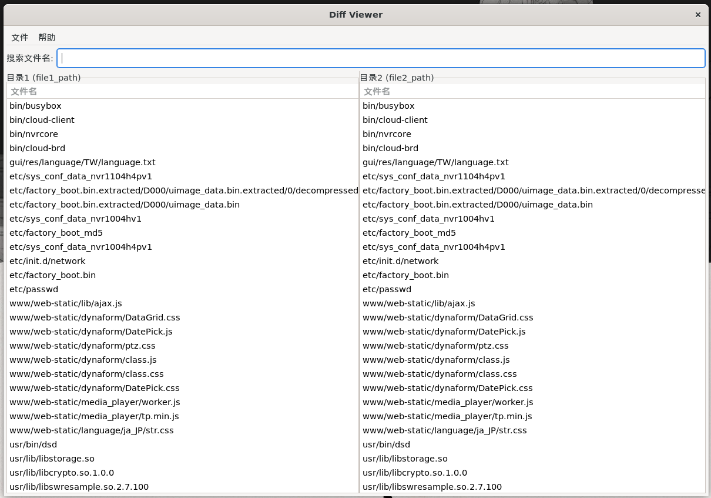
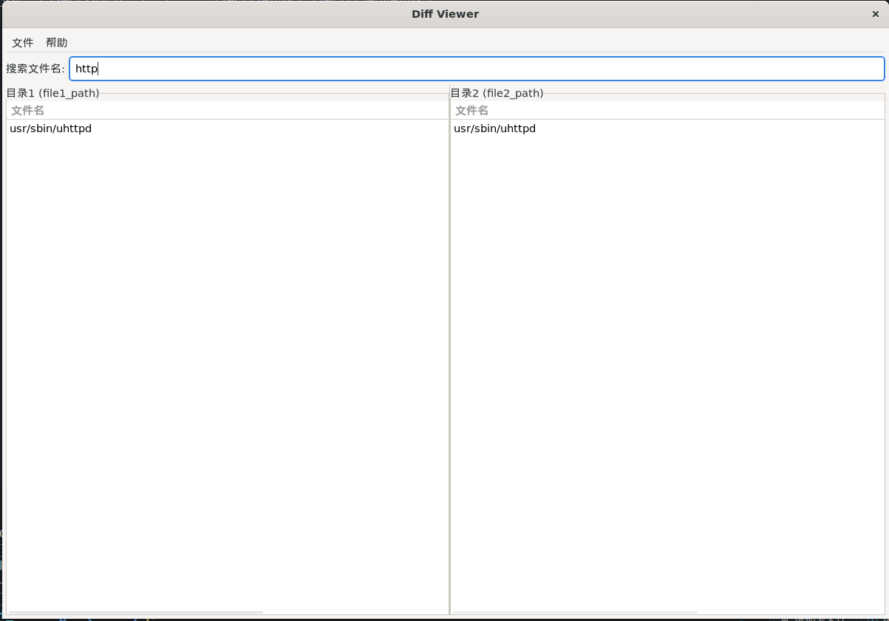

# MD5 Directory Scanner

一个用C语言编写的文件比较工具套件，包含命令行扫描器和图形界面查看器。可以递归计算目录下所有文件的MD5值，并对比两个目录的差异，提供JSON格式输出和GUI可视化查看。

## 功能特性

- **命令行扫描器**: 递归遍历目录计算MD5哈希值
- **JSON文件对比**: 对比两个目录扫描结果，找出相同和不同的文件
- **图形界面查看器**: 使用GTK+开发的GUI工具，可视化查看比较结果
- 支持输出到文件或标准输出
- 包含扫描统计信息和时间戳
- 错误处理和报告
- 支持静态编译，便于分发

## 项目结构

## 编译和安装

### 编译主程序（MD5扫描器）

```bash
make
```

### 编译GUI查看器

```bash
cd diff-ui
make
```

编译静态版本（无需GTK运行时依赖）：

```bash
cd diff-ui
make static
```

### 安装依赖（GUI所需）

Ubuntu/Debian:

```bash
sudo apt-get install libgtk-3-dev pkg-config build-essential
```

CentOS/RHEL:

```bash
sudo yum groupinstall "Development Tools"
sudo yum install gtk3-devel pkgconfig
```

## 快速开始

### 1. 扫描目录并生成JSON

```bash
# 扫描当前目录
./md5_scanner

# 扫描指定目录并输出到文件
./md5_scanner /path/to/directory -o output.json

# 扫描两个目录并对比
./md5_scanner /path/to/dir1 -o dir1.json
./md5_scanner /path/to/dir2 -o dir2.json
./md5_scanner -c dir1.json dir2.json
```

### 2. 使用GUI查看器

```bash
cd diff-ui

# 直接运行，然后通过菜单打开文件
./diff-viewer

# 指定JSON文件运行
./diff-viewer diff.json
```

## GUI界面功能

- **双栏显示**: 左右分别显示两个目录的文件
- **实时搜索**: 顶部搜索框按文件名过滤结果
- **自动去重**: 自动处理重复文件（如busybox符号链接）
- **状态标识**: 清晰显示文件比较状态
- **详细信息**: 显示文件路径、MD5值和比较状态

## 使用方法

### 目录扫描模式

扫描指定目录下的所有文件并生成MD5哈希值。

**基本用法：**

```bash
./md5_scanner <目录路径>
```

**选项：**

- `-o <文件名>`: 将JSON输出保存到指定文件（默认输出到标准输出）
- `-h`: 显示帮助信息

**示例：**

```bash
# 扫描当前目录并输出到控制台
./md5_scanner .

# 扫描指定目录并保存到文件
./md5_scanner -o checksums.json /home/user/documents
```

### JSON对比模式

对比两个JSON文件中的MD5哈希值，找出相同和不同的文件。

**选项：**

- `--diff`: 只生成diff.json文件（包含不同/唯一的哈希值）
- `--same`: 只生成same.json文件（包含相同的哈希值）
- `--both`: 同时生成diff.json和same.json文件

**用法：**

```bash
./md5_scanner --diff <file1.json> <file2.json>
./md5_scanner --same <file1.json> <file2.json>
./md5_scanner --both <file1.json> <file2.json>
```

**示例：**

```bash
# 先扫描两个目录生成JSON文件
./md5_scanner -o dir1.json /path/to/dir1
./md5_scanner -o dir2.json /path/to/dir2

# 对比两个JSON文件，同时生成差异和相同文件
./md5_scanner --both dir1.json dir2.json

# 只生成差异文件
./md5_scanner --diff dir1.json dir2.json

# 只生成相同文件
./md5_scanner --same dir1.json dir2.json
```

## 输出格式

### 目录扫描输出格式

```json
{
  "scan_info": {
    "scanned_directory": "/absolute/path/to/directory",
    "scan_time": "Mon Jul 28 10:30:45 2025",
    "total_files": 150,
    "errors": 0
  },
  "files": [
    {
      "path": "/absolute/path/to/file1.txt",
      "md5": "d41d8cd98f00b204e9800998ecf8427e"
    },
    {
      "path": "/absolute/path/to/file2.txt", 
      "md5": "098f6bcd4621d373cade4e832627b4f6"
    }
  ]
}
```

### 对比输出格式

**same.json (相同哈希值的文件)：**

```json
{
  "comparison_info": {
    "comparison_time": "Mon Jul 28 10:35:20 2025",
    "file1": "dir1.json",
    "file2": "dir2.json", 
    "description": "Files with matching MD5 hashes",
    "total_matches": 5
  },
  "files": [
    {
      "md5": "d41d8cd98f00b204e9800998ecf8427e",
      "file1_path": "/path/to/dir1/same_file.txt",
      "file2_path": "/path/to/dir2/same_file.txt"
    }
  ]
}
```

**diff.json (不同/唯一哈希值的文件)：**

```json
{
  "comparison_info": {
    "comparison_time": "Mon Jul 28 10:35:20 2025",
    "file1": "dir1.json",
    "file2": "dir2.json",
    "description": "Files with different or unique MD5 hashes", 
    "total_differences": 10
  },
  "files": [
    {
      "md5": "098f6bcd4621d373cade4e832627b4f6",
      "file1_path": "/path/to/dir1/unique_file.txt",
      "file2_path": "",
      "status": "only_in_file1"
    },
    {
      "md5": "5d41402abc4b2a76b9719d911017c592",
      "file1_path": "",
      "file2_path": "/path/to/dir2/unique_file.txt", 
      "status": "only_in_file2"
    }
  ]
}
    "total_files": 15,
    "errors": 0
  },
  "files": [
    {
      "path": "/absolute/path/to/file1.txt",
      "md5": "5d41402abc4b2a76b9719d911017c592"
    },
    {
      "path": "/absolute/path/to/file2.txt",
      "md5": "7d865e959b2466918c9863afca942d0f"
    }
  ]
}
```





## 技术实现

### MD5算法

- 实现了完整的MD5哈希算法
- 支持大文件的分块处理
- 内存使用效率高

### 文件遍历

- 使用POSIX标准的目录遍历API
- 递归处理子目录
- 跳过特殊目录（. 和 ..）
- 处理符号链接和特殊文件类型

### JSON输出

- 使用cJSON库处理JSON格式
- 包含元数据信息（扫描时间、文件统计等）
- 格式化输出，便于阅读

## 错误处理

程序会处理以下错误情况：

- 无效的目录路径
- 文件访问权限问题
- 内存分配失败
- JSON生成错误
- 输出文件写入错误

## 兼容性

- 支持Linux和Unix系统
- 需要POSIX兼容的系统调用
- 使用标准C99语法

## 依赖项

- GCC编译器
- POSIX兼容系统
- 标准C库
